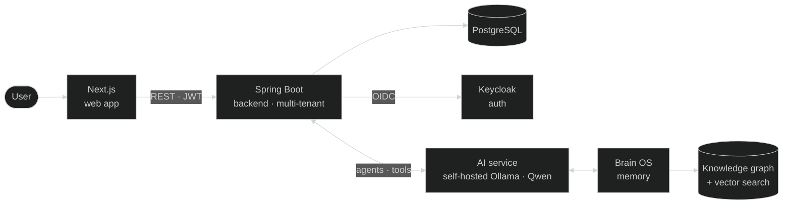
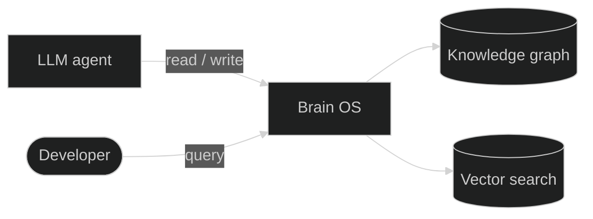
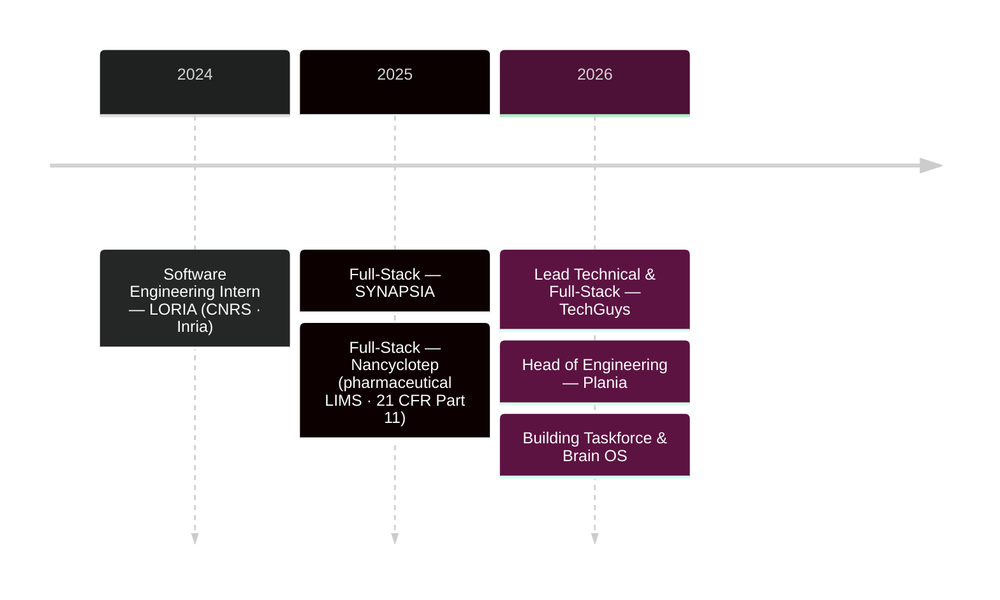

## Hey, I'm Pierre 👋

I take systems end to end — from the business problem to production. Mostly on the **JVM (Java / Spring Boot)**, with **applied AI** where it actually earns its place. Right now I'm **Head of Engineering** on Plania and lead technical / full-stack developer at **TechGuys** (Montréal).

One rule above the rest: **understand the business before you design the architecture.** It's what saves you from rebuilding the whole thing six months later.

Below are the two projects I care about most.

---

## 🧩 Taskforce
> **Describe the outcome — Taskforce orchestrates the execution.**

An **execution layer** that sits on top of the tools a team already uses. You describe *what* needs to happen; an agentic core figures out the *how* and coordinates the work — backed by Brain OS for memory.

Built as a **multi-tenant platform of 9 containerized services**:

What I'm proud of: strict **multi-tenancy** from day one, an **agentic core** that coordinates work across a team's tools, and a **self-hosted LLM** (Ollama · Qwen) — so no customer data ever leaves the box.

📖 **Full architecture, ADRs, API & security docs** → **[@taskforce-project](https://github.com/taskforce-project)**

---

## 🧠 Brain OS
> **Persistent memory for LLM agents.**

Most "AI memory" is just a bigger prompt. Brain OS is the opposite — a structured store of **state, context, and the consequences of actions**, so an agent reasons over what actually happened instead of a window of text.

R&D on the **architecture, not the model** — the hard part of an AI system is rarely the model call. It's the context you give it, and what you do with its answer.

---

## 🧭 How I got here

🎓 **Bachelor, Full-Stack Development** — Metz Numeric School (RNCP Level 6)

---

## 📫 Connect

