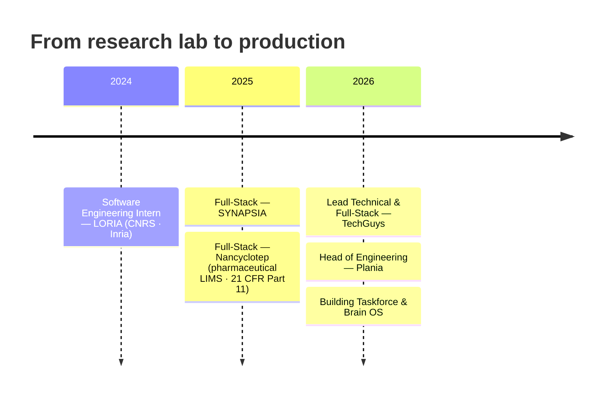

# Pierre Michel

**Software Engineer · Full-Stack & Applied AI**

*I build systems end to end — from the business problem to production.*

---

### 👋 About

Software engineer, mostly on the JVM (**Java / Spring Boot**), with **applied AI** where it earns its place. I like taking a system from framing to production — in startups as much as in regulated environments, in a research lab as much as under a normative framework.

Right now I'm **Head of Engineering** on Plania and lead technical / full-stack developer at **TechGuys** (Montréal), shipping AI-driven products for enterprise clients.

> The principle I keep coming back to: understand the business before you design the architecture. It's what most often saves you from rebuilding a system a few months later.

---

### 🚀 What I'm building

**[Taskforce](https://github.com/taskforce-project) — an execution layer over your tools**
*Describe the outcome, Taskforce orchestrates the execution.* A multi-tenant platform of **9 containerized services**, coupled with Brain OS. Public architecture, ADRs, API and security docs live on the org.

`Java 21` · `Spring Boot` · `Next.js` · `PostgreSQL` · `Keycloak` · `CI/CD`

**Brain OS — persistent memory for LLM agents**
A knowledge graph + vector search that represents **state, context and the consequences of actions** — so agents reason over more than a prompt. R&D on the architecture, not the model.

---

### 🧭 Journey

🎓 **Bachelor, Full-Stack Development** — Metz Numeric School (RNCP Level 6)

---

### 🛠️ Stack

**Backend**

**Frontend**

**Applied AI**

**DevOps & Security**

---

### 🏢 Organizations

- **[@taskforce-project](https://github.com/taskforce-project)** — flagship. Taskforce, the execution layer over your tools, plus Brain OS. Public architecture, ADRs, API & security docs.
- Also active in **[@krypt-project](https://github.com/krypt-project)** and **[@template-agile-scrum](https://github.com/template-agile-scrum)**.

---

### 📊 GitHub

---

### 📫 Connect

- **LinkedIn** — [in/pierre-michel-work](https://www.linkedin.com/in/pierre-michel-work)
- **Email** — [pierre.michel.work@gmail.com](mailto:pierre.michel.work@gmail.com)
